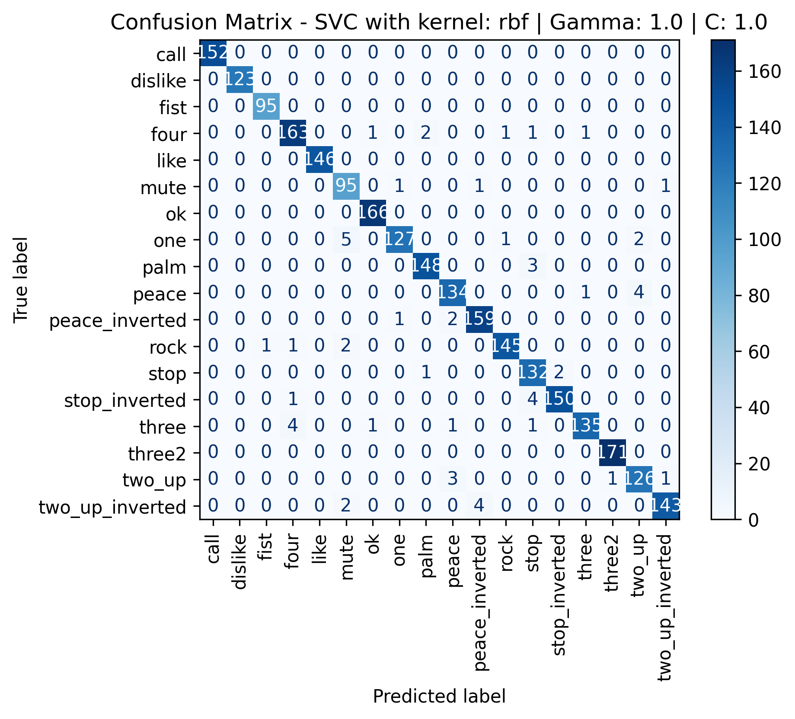
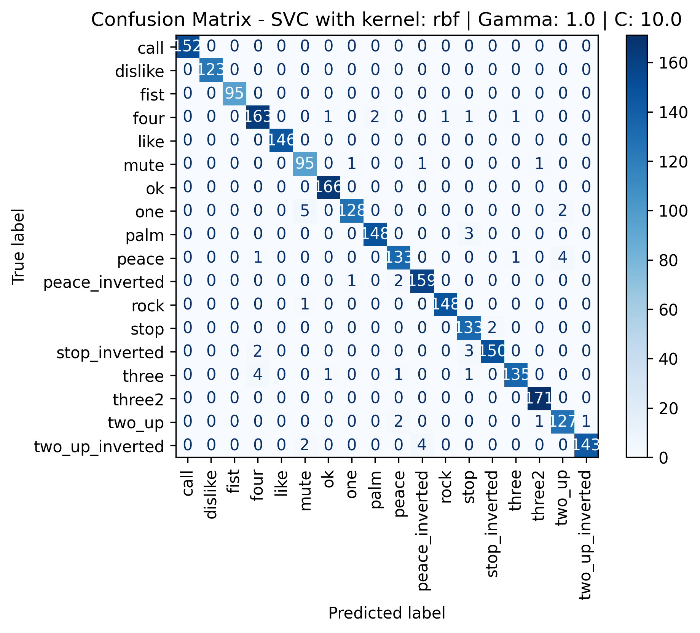
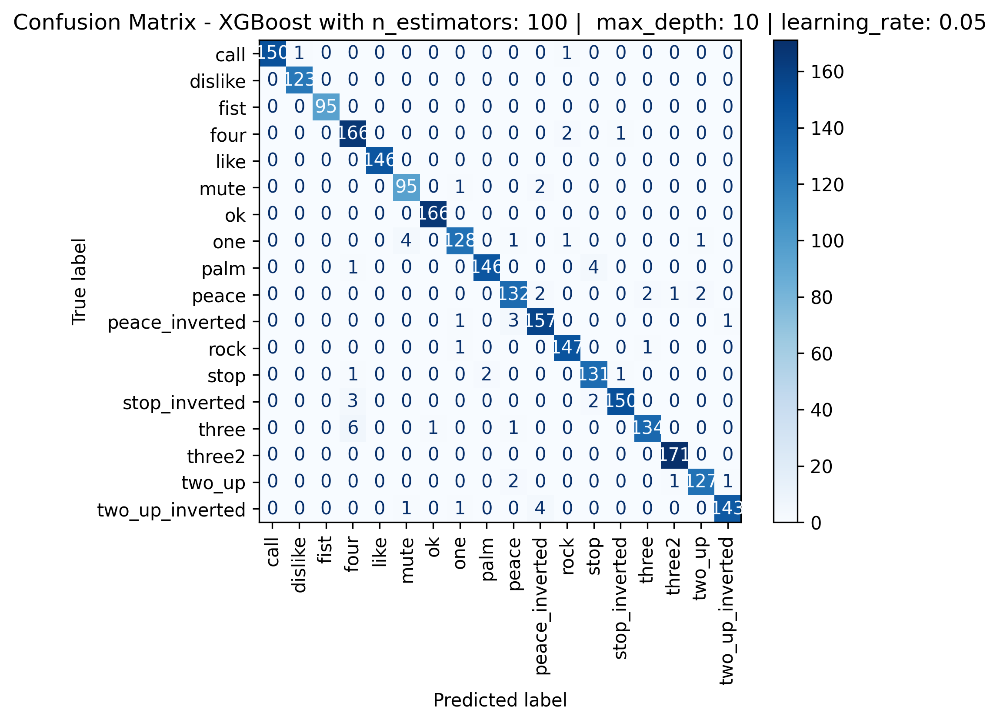

# Hand Gesture Classification using MediaPipe Landmarks

A machine learning project for recognizing hand gestures from **MediaPipe hand landmarks**.  
It compares multiple classifiers (SVC, Random Forest, KNN, XGBoost), tracks experiments with **MLflow**, and provides a real-time webcam inference script.

## Project Goal
The goal of this repository is to build a practical, end-to-end gesture classification pipeline:
- Use hand landmark coordinates (`x, y, z` for 21 points) as features.
- Preprocess landmarks for better invariance (recentering + scaling).
- Train and compare several classic ML models.
- Track experiments, metrics, and artifacts with MLflow.
- Run live predictions from a webcam feed.

## What is in this repository?

### Core assets
- `hand_landmarks_data.csv`: Labeled dataset used for training and evaluation.
- `hand_gesture_classificaiton.ipynb`: Main notebook for exploration, preprocessing, training, and model comparison.
- `gesture_inference.py`: Real-time gesture prediction using webcam + MediaPipe + saved model.
- `MLflow_helper.py`: Utility functions for MLflow tracking, logging, registration, and model metadata.
- `Models/`: Exported trained models (`.joblib`).
- `Figures/`: Confusion matrices for trained model variants.
- `MLflow Screenshots/`: Screenshots of the MLflow UI and model comparison views.

### Dataset summary
- Total samples: **25,675**
- Features per sample: **63** (21 landmarks × 3 axes)
- Gesture classes: **18**

Classes include:
`call, dislike, fist, four, like, mute, ok, one, palm, peace, peace_inverted, rock, stop, stop_inverted, three, three2, two_up, two_up_inverted`

## Method Overview

1. **Data preprocessing**
   - Landmarks are recentered around the wrist.
   - Coordinates are scaled using middle-finger-tip distance to improve scale invariance.

2. **Modeling**
   - Random Forest (20/50/100 estimators)
   - SVC (Linear + RBF variants)
   - KNN
   - XGBoost (shallow/deep settings)

3. **Experiment tracking**
   - Metrics and artifacts are logged to MLflow.
   - Confusion matrices and per-class metrics are saved as artifacts.
   - Selected models are registered in MLflow Model Registry.

## Results (Artifacts)

### Confusion matrices (sample)

| Model | Image |
|---|---|
| SVC (RBF, default) |  |
| SVC (RBF, high C) |  |
| Random Forest (100 trees) |  |
| XGBoost (deep) |  |

### MLflow snapshots

| MLflow view | Image |
|---|---|
| Experiment dashboard |  |
| Comparing models |  |
| Registered models |  |

### Model performance comparison (Test set)

> Metrics below are from the notebook test split, with macro-averaged Precision/Recall/F1.

| Model | Accuracy | Precision | Recall | F1-score |
|---|---:|---:|---:|---:|
| Random Forest (20 trees) | 0.9712 | 0.9708 | 0.9708 | 0.9706 |
| Random Forest (50 trees) | 0.9774 | 0.9765 | 0.9773 | 0.9767 |
| Random Forest (100 trees) | 0.9794 | 0.9788 | 0.9793 | 0.9789 |
| SVC (Linear, C=1) | 0.8497 | 0.8537 | 0.8537 | 0.8521 |
| SVC (RBF, C=1) | 0.9844 | 0.9846 | 0.9838 | 0.9841 |
| SVC (RBF, C=10) | 0.9883 | 0.9883 | 0.9877 | 0.9880 |
| KNN (k=5) | 0.9747 | 0.9743 | 0.9739 | 0.9740 |
| XGBoost (shallow) | 0.9696 | 0.9694 | 0.9699 | 0.9694 |
| XGBoost (deep) | 0.9762 | 0.9765 | 0.9761 | 0.9762 |

### Top 3 model types

Based on the test-set comparison above, the strongest three model types in this project are:

1. **SVC (RBF, C=10)** — best overall performance across metrics.
2. **Random Forest (100 trees)** — strong and stable second-best performance.
3. **XGBoost (deep)** — competitive third-best model with solid generalization.

## How to run this project locally

## 1) Clone and enter the project
```bash
git clone https://github.com/Mostafa710/Hand-Gesture-Classification-using-MediaPipe-Landmarks.git
cd Hand-Gesture-Classification-using-MediaPipe-Landmarks
```

## 2) Create a virtual environment
```bash
python -m venv .venv
source .venv/bin/activate      # Linux / macOS
# .venv\Scripts\activate       # Windows PowerShell
```

## 3) Install dependencies
```bash
pip install --upgrade pip
pip install -r requirements.txt
```

> If you face dependency resolution issues, install key packages manually with compatible versions of: `scikit-learn`, `xgboost`, `mediapipe`, `opencv-python`, `mlflow`, `numpy`, `pandas`, `matplotlib`.

## 4) Run the notebook (training / analysis)
```bash
jupyter notebook hand_gesture_classificaiton.ipynb
```

## 5) Launch MLflow UI (optional)
From the project root:
```bash
mlflow ui --host 127.0.0.1 --port 5000
```
Then open: `http://127.0.0.1:5000`

## 6) Run real-time inference
```bash
python gesture_inference.py
```
- Press **q** to exit.
- Make sure your webcam is available.
- The script currently loads `./Models/gesture_svc.joblib` by default.

## Inference Pipeline (Realtime)
1. Capture webcam frame.
2. Detect hand landmarks using MediaPipe.
3. Build a 63-feature vector.
4. Apply the same preprocessing used in training.
5. Predict gesture label with the saved model.
6. Overlay the prediction on the video stream.

## Repository Structure
```text
.
├── Figures/
├── MLflow Screenshots/
├── Models/
├── MLflow_helper.py
├── gesture_inference.py
├── hand_gesture_classificaiton.ipynb
├── hand_landmarks_data.csv
└── requirements.txt
```

## Notes and Limitations
- The project focuses on **single-hand gesture classification**.
- Inference script is configured with `max_num_hands=1`.
- Performance in real-world use depends on camera quality, lighting, and hand visibility.

## Contact
For questions or collaboration, feel free to connect:
[LinkedIn](https://www.linkedin.com/in/mostafa-mamdouh-80b110228)